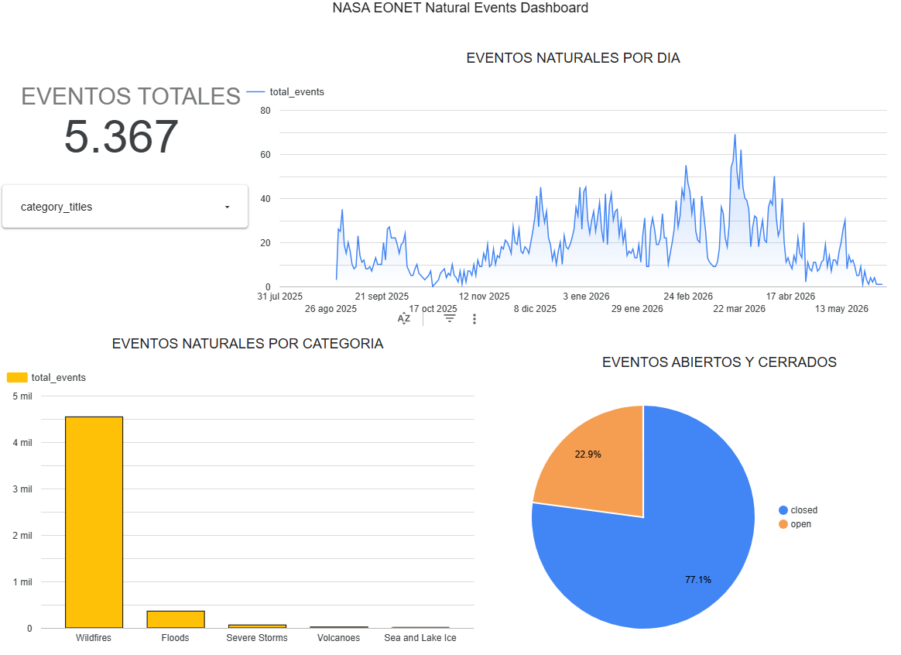
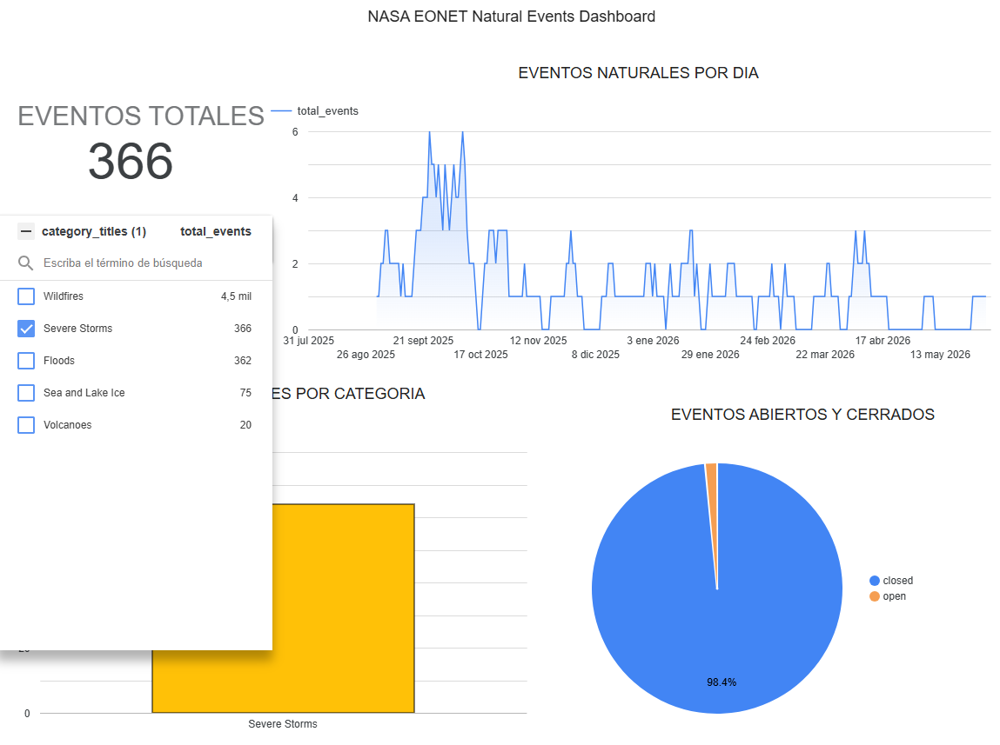
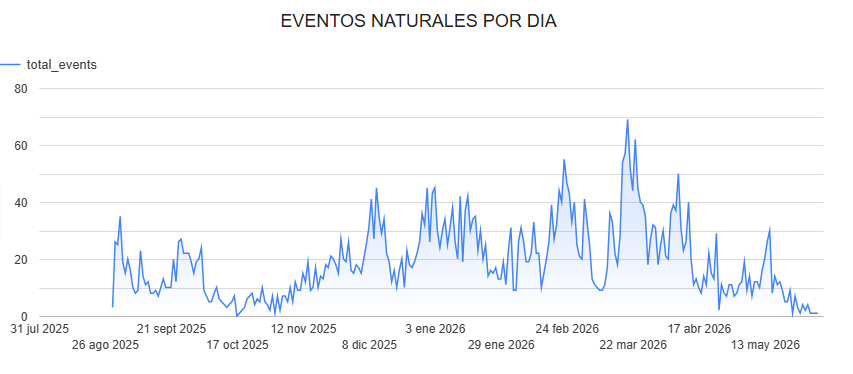
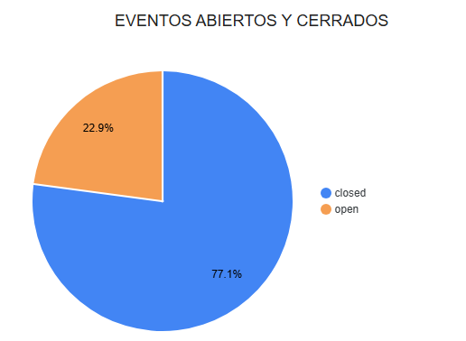
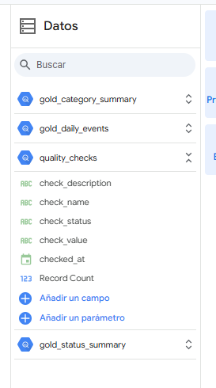

# Dashboard Looker Studio

Esta carpeta contiene evidencias del dashboard desarrollado en Looker Studio para el proyecto NASA EONET.

## Fuente del dashboard

El dashboard se conecta a las tablas Gold de BigQuery:

- `eonet_gold.gold_category_summary`
- `eonet_gold.gold_daily_events`
- `eonet_gold.gold_status_summary`
- `eonet_gold.quality_checks`

## Visualizaciones incluidas

El dashboard contiene:

- Eventos naturales por categoría.
- Eventos naturales por día.
- Eventos por estado: abiertos y cerrados.
- Filtro por categoría, por ejemplo `Wildfires`.
- Tabla de validaciones de calidad de datos.

## Evidencias

| Archivo | Descripción |
|---|---|
| `1_looker_dashboard_general.png`
 | Vista general del dashboard |
| `02_looker_category_filter.png` 
| Filtro por categoría aplicado en el dashboard |\
| `03_looker_daily_events.png` 
| Eventos por día desde tabla Gold |
| `04_looker_status_summary.png` 
| Eventos abiertos y cerrados |
| `05_looker_quality_checks.png` 
| Validaciones de calidad de datos, evidencia de tablas creadas.|

## Observación

Looker Studio no almacena el código dentro del repositorio. Por eso se documenta mediante capturas y explicación técnica en esta carpeta.

El dashboard consume las tablas Gold generadas en BigQuery, por lo que los datos se actualizarán cuando el pipeline actualice las tablas Gold.

Link al Dashboard. 

https://datastudio.google.com/s/v_kGf_RZJyo
