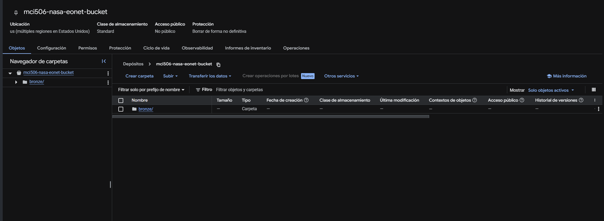
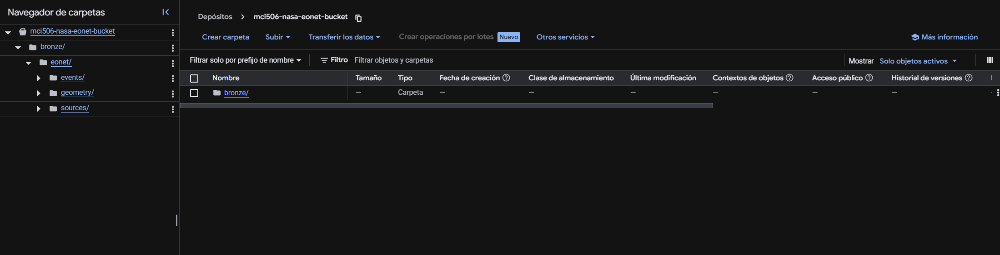
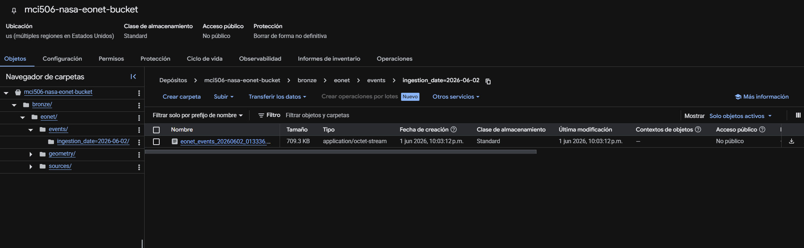
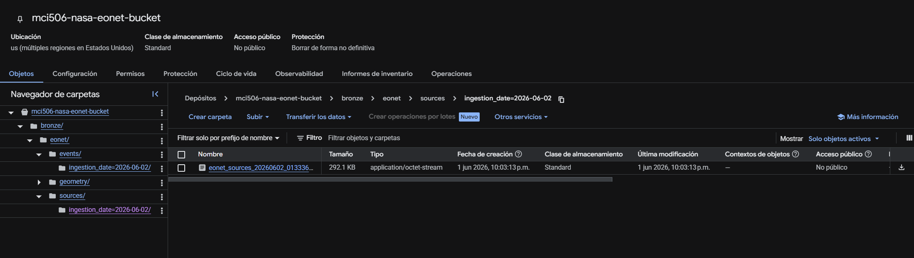
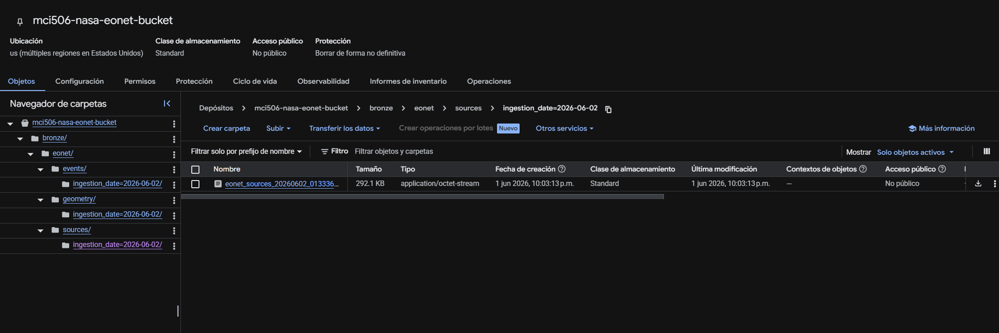
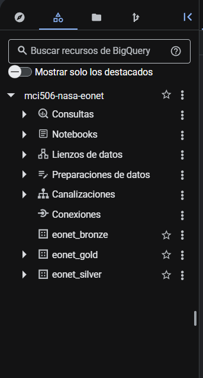

# Evidencias del Proyecto NASA EONET

Esta carpeta contiene capturas del avance del proyecto hasta la capa Bronze.

## Avance documentado

Hasta este punto se completaron:

- PR 1: estructura inicial del proyecto.
- PR 2: extracción desde NASA EONET.
- PR 3: carga de archivos Parquet a Google Cloud Storage.

## Evidencias incluidas

| Archivo | Descripción |
|---|---|
| `01_gcs_bucket_bronze.png` 
 | Bucket usado para almacenar la capa Bronze |
| `02_gcs_bronze_eonet_structure.png` 
  | Estructura `bronze/eonet/` en GCS |
| `03_gcs_events_parquet.png` 
 | Archivo Parquet de `events` cargado en GCS |
| `04_gcs_sources_parquet.png` 
  | Archivo Parquet de `sources` cargado en GCS |
| `05_gcs_geometry_parquet.png` 
  | Archivo Parquet de `geometry` cargado en GCS |
| `06_bigquery_datasets.png` 
 | Datasets creados en BigQuery |
| `07_github_pull_requests.png` | Pull Requests realizados por el equipo |
| `08_github_actions_pipeline.png` | Workflow de GitHub Actions configurado |

## Rutas principales en GCS

- `bronze/eonet/events/`
- `bronze/eonet/sources/`
- `bronze/eonet/geometry/`

Estas rutas serán usadas después para crear las tablas externas en BigQuery.